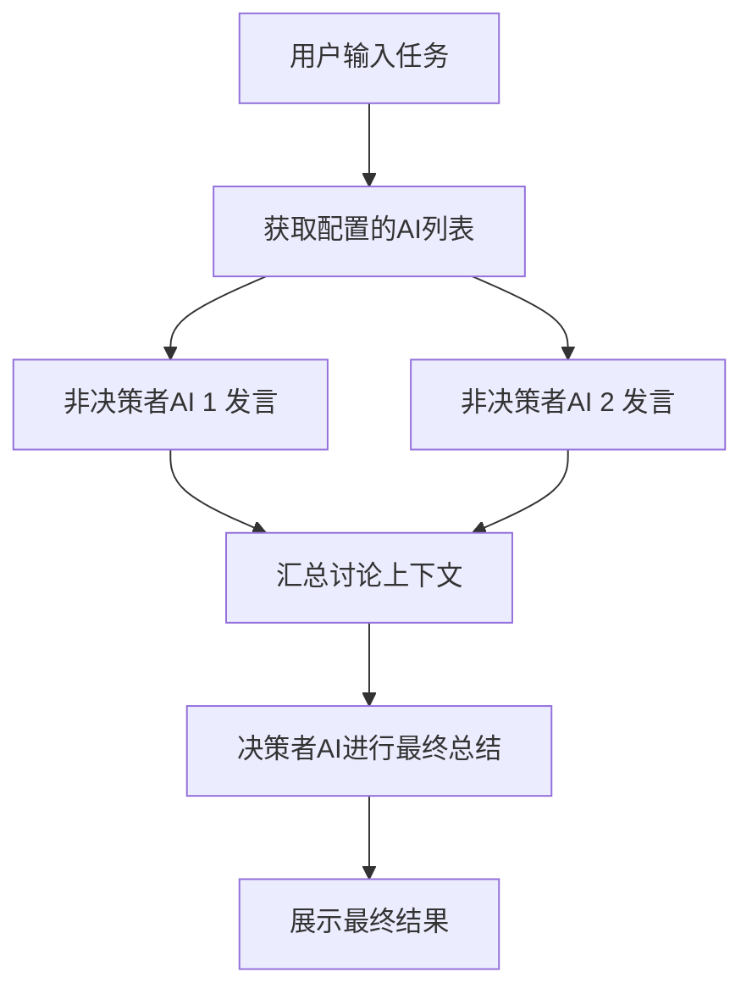

## 1. 产品概述
一款创新的多AI协作文档创作网页应用。旨在解决单一AI辅助创作时思路受限、语言风格单调的问题。
- 允许用户手动配置多个大模型API，并为它们分配不同的角色（如：发散者、批评家、决策者）。
- 针对用户的创作任务，多个AI会进行模拟讨论，最后由“决策者”AI给出融合多方观点的统一高质量答案。

## 2. 核心功能

### 2.1 用户角色
| 角色 | 注册方式 | 核心权限 |
|------|---------------------|------------------|
| 本地用户 | 无需注册，本地存储 | 配置API、设置AI角色、发起创作任务、导出结果 |

### 2.2 功能模块
1. **工作台页面**: 包含API配置面板、角色设置、任务输入区、多AI实时讨论区、最终结果展示区。

### 2.3 页面详情
| 页面名称 | 模块名称 | 功能描述 |
|-----------|-------------|---------------------|
| 工作台 | API与角色配置 | 手动添加多个兼容OpenAI格式的API接口地址和Key，为每个API设置角色设定（Prompt）及是否为“决策者” |
| 工作台 | 任务输入 | 输入文档修改或创作的具体要求 |
| 工作台 | 实时讨论区 | 瀑布流展示多个AI针对任务的发言和相互讨论（通过前置AI的输出作为后置AI的输入进行轮转讨论） |
| 工作台 | 结果展示区 | 专门展示决策者AI根据讨论记录总结出的最终文档，支持一键复制或导出 |

## 3. 核心流程
用户配置多模型API与角色 -> 输入创作任务并启动 -> 系统按顺序或并发调用非决策者AI进行思考和发言 -> 收集所有讨论上下文 -> 调用决策者AI进行最终总结 -> 输出统一答案。

## 4. 用户界面设计
### 4.1 设计风格
- 极简、现代、专业，类似Notion或Linear的设计美学。
- 主色调：纯白/浅灰背景，使用不同的柔和色块（如浅蓝、浅绿、浅紫）来区分不同AI角色的发言。
- 字体：使用 Inter 或系统默认的无衬线字体，保证长文本阅读体验。
- 布局：左右分栏结构（左侧配置，右侧工作流），右侧采用上下布局（任务、讨论过程、最终结果）。

### 4.2 页面设计概述
| 页面名称 | 模块名称 | UI元素 |
|-----------|-------------|-------------|
| 工作台 | 侧边栏配置 | 表单输入框、添加/删除按钮、API连通性测试状态指示灯 |
| 工作台 | 讨论区 | 聊天气泡样式或卡片样式，包含AI名称、角色标签、打字机动画显示内容 |
| 工作台 | 最终结果 | 宽大的富文本/Markdown渲染卡片，带高亮和“复制”操作栏 |

### 4.3 响应式设计
- 桌面端优先：充分利用宽屏展示配置栏和讨论流。
- 移动端适配：左侧边栏可折叠为汉堡菜单，讨论区和结果区自适应单列流式布局。
