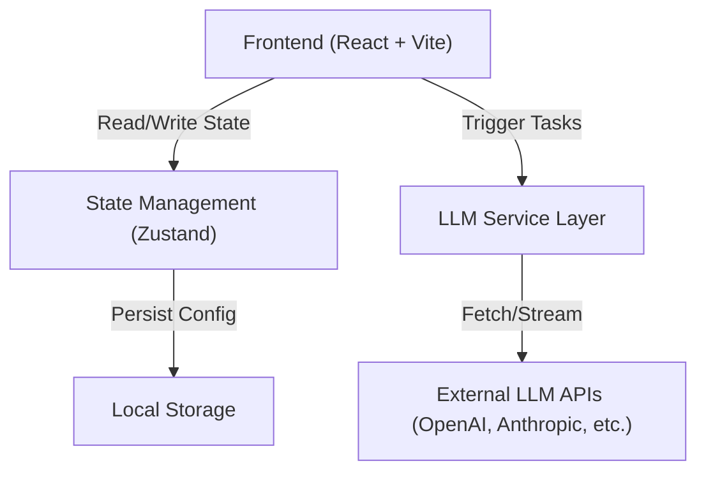

## 1. 架构设计


## 2. 技术栈说明
- **前端框架**: React@18 + tailwindcss@3 + vite
- **状态管理**: Zustand (用于管理API配置、AI角色列表、当前讨论状态、消息历史)
- **UI 组件库**: lucide-react (图标), tailwind-merge, clsx (样式处理), react-markdown (Markdown渲染)
- **API 交互**: 原生 fetch 配合 ReadableStream 处理流式输出 (Server-Sent Events)

## 3. 路由定义
由于是纯客户端单页应用，主要在一个页面完成所有操作，可不引入复杂路由。
| 路由 | 用途 |
|-------|---------|
| / | 主工作台页面（包含配置面板和讨论流） |

## 4. API 定义 (前端直接调用大模型API)
应用将主要模拟 OpenAI 的 Chat Completions 接口格式，因为大多数平台（如 DeepSeek, Kimi, 阿里千问等）都兼容该格式。

**配置数据结构 (本地存储)**
```typescript
interface AIModelConfig {
  id: string;
  name: string; // 显示名称，如 "发散思考者"
  rolePrompt: string; // 系统提示词
  apiUrl: string; // API 端点，如 "https://api.openai.com/v1/chat/completions"
  apiKey: string;
  model: string; // 模型名称，如 "gpt-3.5-turbo"
  isDecisionMaker: boolean; // 是否为最终决策者
}
```

**请求格式 (调用外部大模型)**
```typescript
interface ChatCompletionRequest {
  model: string;
  messages: Array<{
    role: "system" | "user" | "assistant";
    content: string;
  }>;
  stream: boolean;
}
```

## 5. 核心业务逻辑 (AI讨论引擎)
1. **初始化任务**: 用户输入主题，将其作为初始 user prompt 传递给所有的非决策者 AI。
2. **并发/轮询讨论**: 
   - 方式A（并发）：各AI基于系统提示词和用户任务并发生成观点。
   - 方式B（轮流）：AI 1 发言后，将其输出拼接为上下文，传给 AI 2，以此类推。（为简化首版，可先采用**并发模式**生成各自的观点）。
3. **决策者总结**: 收集所有非决策者 AI 的输出，拼接成最终的任务 Prompt，发送给标记为 `isDecisionMaker` 的 AI，要求其综合讨论结果并给出最终的统一输出。
