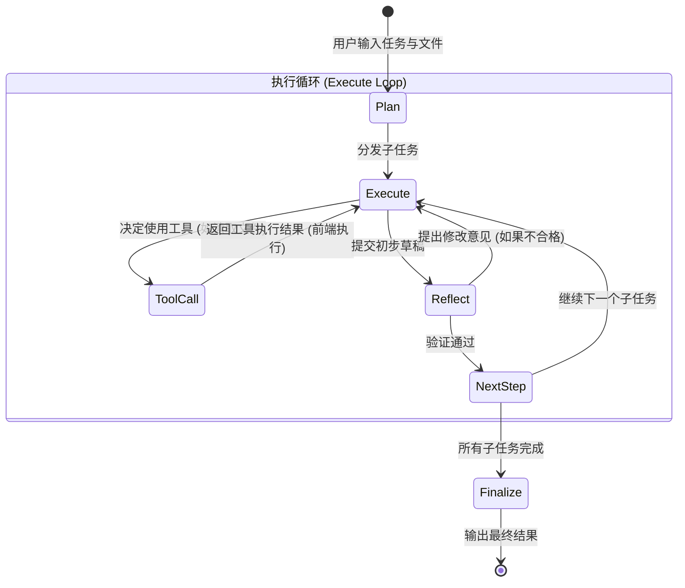

# 多 AI 协作 Agent 应用架构升级设计方案 (纯前端版)

为了将当前的“并发讨论 -> 汇总” (Map-Reduce) 简单模型升级为一个更完整的 Agent 应用，我们将引入**任务拆解与计划 (Plan)**、**工具调用 (Tool Calling/Action)**、**多轮反思 (Reflection)** 以及**上下文管理**的机制，使其更接近真实的 Agent 工作流 (如 ReAct 或 Plan-and-Execute 模式)。

当前阶段我们将保持纯前端架构，利用浏览器能力实现文件读取等轻量级工具。后续可平滑迁移至 Next.js 全栈架构。

## 1. 核心架构演进：ReAct 工作流

我们将把 AI 的执行过程从“单次生成”转变为“观察-思考-行动-观察”的循环：

1. **Plan (计划者 AI)**：分析用户任务，拆解为多个子步骤。
2. **Execute (执行者 AI)**：针对每个子步骤进行执行。它具备**调用工具**的能力。
3. **Observe (工具执行)**：前端捕获到工具调用请求，执行对应的浏览器操作（如读取上传的文件），将结果返回给执行者 AI。
4. **Reflect (批评家 AI)**：对执行者的输出进行检查，如果发现错误或偏离目标，提出修改意见并打回重做。
5. **Finalize (决策者 AI)**：所有步骤完成后，进行最终的排版和整合输出。



## 2. 核心功能设计

### 2.1 文件导入与上下文管理 (Context)
- **UI 升级**：在任务输入区增加文件上传按钮（支持 `.txt`, `.md`, `.json`, `.csv` 等文本类文件）。
- **前端处理**：利用浏览器的 `FileReader API` 读取文件内容。
- **Context 注入**：将读取的文件内容作为系统上下文 (System Context) 或作为工具的可用资源提供给 AI。

### 2.2 工具调用 (Tool Calling) 机制
虽然是纯前端，但我们可以模拟一套标准的大模型 Function Calling 接口：
- **定义工具**：
  - `read_uploaded_file(filename)`: 读取用户上传的特定文件内容。
  - `web_search_simulate(query)`: (演示用) 模拟搜索，返回预设数据或调用免费的跨域 API。
  - `calculate(expression)`: 前端执行数学计算。
- **工作原理**：
  当执行者 AI 输出特定的工具调用指令（如 JSON 格式或标准的 `tool_calls` 响应）时，前端引擎拦截该响应，停止流式输出，在本地执行对应工具，然后将结果（`tool_message`）追加到对话历史中，再次请求 AI。

### 2.3 更好的思考链路 (Thinking Chain)
- 在界面上为每个角色增加“状态指示器”：`规划中...` -> `执行任务1...` -> `调用工具...` -> `反思与自我纠正...`。
- 将“思考过程”和“最终输出”在 UI 上做更明显的层级区分。

## 3. 状态管理与引擎重构

我们需要重构 `src/utils/aiEngine.ts` 和 `src/store/useStore.ts`。

### 3.1 状态树 (Zustand) 更新
```typescript
interface AppState {
  // ... 现有状态
  uploadedFiles: Array<{ name: string; content: string }>;
  currentStep: 'planning' | 'executing' | 'reflecting' | 'finalizing';
  executionLogs: Array<{
    type: 'thought' | 'action' | 'observation' | 'result';
    content: string;
    agentName: string;
  }>;
}
```

### 3.2 Agent 引擎循环 (The Engine Loop)
原先的并发 `Promise.all` 将被替换为一个**状态机循环**或**异步生成器 (Async Generator)**：

```typescript
// 伪代码示例
async function runAgentWorkflow(task, files) {
  // 1. 计划阶段
  const plan = await callPlanner(task);
  
  for (const step of plan.steps) {
    // 2. 执行阶段 (带工具调用循环)
    let stepResult = await executeWithTools(step, files);
    
    // 3. 反思阶段
    let reflection = await callCritic(stepResult, step);
    while (!reflection.isApproved) {
       stepResult = await executeWithTools(step, files, reflection.feedback);
       reflection = await callCritic(stepResult, step);
    }
  }
  
  // 4. 总结阶段
  return callDecisionMaker(allStepResults);
}
```

## 4. UI/UX 改造
1. **角色细分**：在左侧边栏，将 AI 的配置明确分类为 `Planner (计划者)`、`Executor (执行者)`、`Critic (批评家)` 和 `Decision Maker (决策者)`，各自承担不同的 System Prompt。
2. **工作流可视化**：右侧的主工作区不再是简单的两列瀑布流，而是变成一个**时间线 (Timeline)** 或**步骤条 (Stepper)**，实时展示 Agent 当前处于哪个环节，调用了什么工具。
3. **文件拖拽区**：在底部的输入框区域增加支持拖拽的文件上传池。

## 5. 未来演进：Next.js 全栈架构 (Next Phase)
当后续拓展为 Next.js 全栈时，该纯前端架构可平滑迁移：
- **后端执行**：复杂工具（如真实的 Puppeteer 爬虫、数据库查询、Python 代码沙箱执行）将移至 Next.js API Routes 或 Server Actions。
- **持久化**：从 LocalStorage 迁移至 PostgreSQL/Supabase，实现多端同步和团队协作。
- **长时任务**：引入 Redis + 队列 (如 BullMQ)，支持运行数小时的复杂自动化 Agent 任务。
