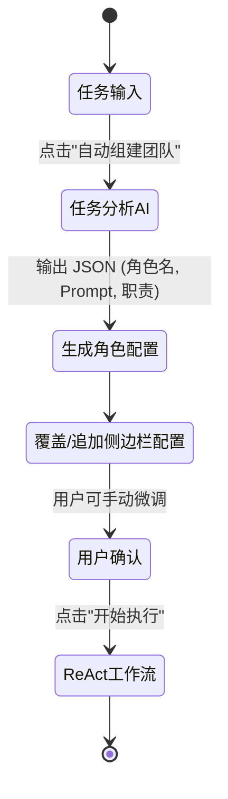

# Agent 团队自动分配功能 (Task Analysis AI) 设计方案

为了实现“让 AI 根据用户任务自主分配团队角色”的功能，我们将引入一个新的核心模块：**Task Analysis AI (任务分析器)**。

## 1. 核心流程演进

现在的用户体验流程将升级为：

1. **输入任务**：用户在工作区输入需求（如“帮我写一份产品发布会的演讲稿”）。
2. **自动组建团队 (Auto-Team Builder)**：
   - 触发内置的“任务分析 AI”。
   - 它会分析任务，并决定需要几个角色（例如：撰稿人、幽默感顾问、产品经理），以及谁来做最后的决策。
   - 分析完成后，**自动在左侧配置栏生成对应的 AI 角色列表**（包括名称、Role Prompt、是否决策者）。
3. **确认/微调**：用户可以审查生成的团队，进行微调（也可以保留给特定角色换用其他 API 的权利）。
4. **开始工作流**：点击执行，原有的 ReAct 工作流引擎开始按计划执行。



## 2. 全局 API 配置与继承

为了让任务分析 AI 能无缝创建多个子 Agent，而不需要用户反复填 Key，我们将改造状态树：

### 2.1 全局配置 (Global Config)
在侧边栏顶部增加一个全局配置区域：
- **Global API URL**: `https://api.deepseek.com/v1/chat/completions` (默认)
- **Global API Key**: (必填)
- **Global Model**: `deepseek-chat` (默认)

### 2.2 角色配置继承 (Fallback)
现有的 `AIModelConfig` 保持不变，但允许 `apiUrl`, `apiKey`, `model` 为空。
如果在执行时这些字段为空，系统会自动 fallback（降级）使用 Global 配置。
- 这满足了“统一全局 API，但保留用户为特定角色（如决策者）自定义高级模型（如 Claude/GPT-4）的权利”。

## 3. 任务分析 AI (Task Analysis AI) 的实现

### 3.1 提示词设计
任务分析 AI 的 System Prompt 必须强制其输出可解析的 JSON 数组，例如：

```json
{
  "team": [
    {
      "name": "创意发散者",
      "rolePrompt": "你是一个充满创意的发散思维专家...",
      "isDecisionMaker": false,
      "color": "bg-blue-100"
    },
    {
      "name": "主编与决策者",
      "rolePrompt": "你是一位资深主编，负责汇总...",
      "isDecisionMaker": true,
      "color": "bg-yellow-100"
    }
  ]
}
```

### 3.2 触发机制
在工作区的输入框旁边增加一个新按钮：`✨ 自动组建团队`。
点击后：
1. 读取全局 API 配置。
2. 将用户当前输入的 `task` 发送给任务分析 AI。
3. 解析返回的 JSON。
4. 清空（或追加）现有的侧边栏配置，渲染新的团队。

## 4. 数据结构变更 (`src/store/useStore.ts`)

```typescript
interface GlobalConfig {
  apiUrl: string;
  apiKey: string;
  model: string;
}

interface AppState {
  globalConfig: GlobalConfig;
  setGlobalConfig: (config: Partial<GlobalConfig>) => void;
  // ... existing states
  setAIConfigs: (configs: AIModelConfig[]) => void; // 用于覆盖现有团队
}
```

## 5. 错误处理与用户反馈
- 如果解析 JSON 失败，提示用户重试或手动调整。
- 在“自动组建团队”过程中，显示清晰的加载动画（如“正在为您招募专家团队...”）。
